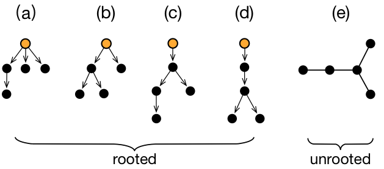

### Reference implementation for Cascade Virality
<br/>




<br/>

`tools.py`: Python code for quantifying cascade virality

`demo.ipynb`: demonstration of how to use

<br/>

Main dependencies:
```
time
numpy
networkx
matplotlib
pygraphviz (if using graphviz_layout)
```


---
#### If you find this useful in your project, please consider cite our paper:
> Go viral or go broadcast? Characterizing the virality and growth of cascades
