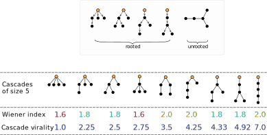

### Reference implementation for Cascade Virality
<br/>





<br/>

`tools.py`: functions for quantifying cascade virality

`demo.ipynb`: demonstration of how to use

<br/>

Main dependencies:
```
time
numpy
networkx
matplotlib
pygraphviz (needed if graphviz_layout is used)
```


---
#### If you find this useful in your project, please consider citing our paper:
> **Viral vs. broadcast: Characterizing the virality and growth of cascades**. <br/>
Yafei Zhang, Lin Wang, Jonathan J. H. Zhu, Xiaofan Wang <br/>
<em>EPL (Europhysics Letters)</em>, 131(2), 28002 (2020). <br/>
[EPL journal link](https://iopscience.iop.org/article/10.1209/0295-5075/131/28002/meta)

A long version of this paper is also available at arXiv preprint:
> **Go viral or go broadcast? Characterizing the virality and growth of cascades**. <br/>
<em>arXiv:2006.01027</em> <br/>
[arXiv link](https://arxiv.org/abs/2006.01027)

Should you have any further quires about the code, please contact at: yflyzhang_at_gmail.com
